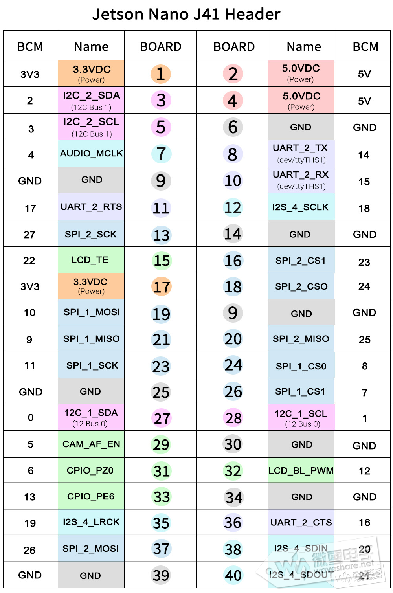

# Jetson Nano 折腾记

## 性能简述

### 技术规格

| GPU      | NVIDIA Maxwell™ 架构，配备 128 个 NVIDIA CUDA® 核心 |
| -------- | --------------------------------------------------- |
| CPU      | 四核 ARM® Cortex®-A57 MPCore 处理器                 |
| 内存     | 4 GB 64 位 LPDDR4                                   |
| 存储     | Micro SD 卡卡槽（需要另购16G以上SD卡接入）          |
| 视频编码 | 4K @ 30 (H.264/H.265)                               |
| 视频解码 | 4K @ 60 (H.264/H.265)                               |
| 摄像头   | 12 通道（3x4 或 4x2）MIPI CSI-2 DPHY 1.1 (1.5 Gbps) |
| 连接     | 千兆以太网                                          |
| 显示器   | HDMI 2.0 或 DP1.2 \| eDP 1.4 \| DSI (1 x2) 2 同步   |
| UPHY     | 1 x1/2/4 PCIE、1x USB 3.0、3x USB 2.0               |
| I/O      | 1x SDIO/2x SPI/4x I2C/2x I2S/GPIO                   |

### 性能(官方数据)

| **Model**                  | **Application**  | **Framework** | **NVIDIA Jetson Nano** | **Raspberry Pi 3** | **Raspberry Pi 3 + Intel Neural Compute Stick 2** | **Google Edge TPU Dev Board** |
| -------------------------- | ---------------- | ------------- | ---------------------- | ------------------ | ------------------------------------------------- | ----------------------------- |
| ResNet-50(224×224)         | Classification   | TensorFlow    | 36 FPS                 | 1.4 FPS            | 16 FPS                                            | DNR                           |
| MobileNet-v2(300×300)      | Classification   | TensorFlow    | 64 FPS                 | 2.5 FPS            | 30 FPS                                            | 130 FPS                       |
| SSD ResNet-18 (960×544)    | Object Detection | TensorFlow    | 5 FPS                  | DNR                | DNR                                               | DNR                           |
| SSD ResNet-18 (480×272)    | Object Detection | TensorFlow    | 16 FPS                 | DNR                | DNR                                               | DNR                           |
| SSD ResNet-18 (300×300)    | Object Detection | TensorFlow    | 18 FPS                 | DNR                | DNR                                               | DNR                           |
| SSD Mobilenet-V2 (960×544) | ObjectDetection  | TensorFlow    | 8 FPS                  | DNR                | 1.8 FPS                                           | DNR                           |
| SSD Mobilenet-V2 (480×272) | Object Detection | TensorFlow    | 27 FPS                 | DNR                | 7 FPS                                             | DNR                           |
| SSD Mobilenet-V2(300×300)  | Object Detection | TensorFlow    | 39 FPS                 | 1 FPS              | 11 FPS                                            | 48 FPS                        |
| Inception V4(299×299)      | Classification   | PyTorch       | 11 FPS                 | DNR                | DNR                                               | 9 FPS                         |
| Tiny YOLO V3(416×416)      | Object Detection | Darknet       | 25 FPS                 | 0.5 FPS            | DNR                                               | DNR                           |
| OpenPose(256×256)          | Pose Estimation  | Caffe         | 14 FPS                 | DNR                | 5 FPS                                             | DNR                           |
| VGG-19 (224×224)           | Classification   | MXNet         | 10 FPS                 | 0.5 FPS            | 5 FPS                                             | DNR                           |
| Super Resolution (481×321) | Image Processing | PyTorch       | 15 FPS                 | DNR                | 0.6 FPS                                           | DNR                           |
| Unet(1x512x512)            | Segmentation     | Caffe         | 18 FPS                 | DNR                | 5 FPS                                             | DNR                           |

## 基础配置

### 1. 安装镜像

安装镜像到 SD 卡中

​		使用镜像  Jetpack，请从官网下载最新版

工具 :

- SD Card Formatter
- balenaEtcherPortable

先用SD Card Formatter格式化SD卡，再用balenaEtcherPortable安装镜像

### 2. 更换镜像源

**注意：** jetson nano是arm框架，应换为相应的镜像源，普通linux使用框架不同。

进入Ubuntu系统之后，我们发现使用以下命令，查看ubuntu版本：

```
cat /etc/issue 
```

根据Ubuntu的版本号，配置相关的源镜像。跳转到源文件所在的目录:

```
cd  /etc/apt/
```

可以使用文件编辑工具打开sources.list文件:

```
sudo gedit /etc/apt/sources.list
```

直接用以下内容替换 sources.list文件中的所有内容即可：

```
deb https://mirrors.ustc.edu.cn/ubuntu-ports/ bionic main restricted universe multiverse
deb https://mirrors.ustc.edu.cn/ubuntu-ports/ bionic-updates main restricted universe multiverse
deb https://mirrors.ustc.edu.cn/ubuntu-ports/ bionic-backports main restricted universe multiverse
deb https://mirrors.ustc.edu.cn/ubuntu-ports/ bionic-security main restricted universe multiverse
```

也可以参照以下链接，自行配置  [Ubuntu Ports 源使用帮助](http://mirrors.ustc.edu.cn/help/ubuntu-ports.html)

### 3. cuda，cudnn，tensorrt，OpenCV配置

!!! 请不要进行任何操作，所有库都在官方镜像中已经配置好了
!!! 请不要进行任何操作，所有库都在官方镜像中已经配置好了
!!! 请不要进行任何操作，所有库都在官方镜像中已经配置好了

### 4. 安装常用工具(库)

#### (1) python3   pip3工具

pip3 工具安装

```
sudo apt-get update
sudo apt-get install python3-pip
```

pip3 升级最新版本

```
pip3 install --upgrade pip
```

pip3 更改镜像源：

​	打开 bash，执行

```bash
python3 -m pip install --upgrade pip
pip3 config set global.index-url https://pypi.tuna.tsinghua.edu.cn/simple
```

#### (2) jupyter lab 安装及配置

安装：

```
sudo apt install nodejs npm   //安装依赖
pip3 install jupyter jupyterlab
sudo reboot
```

启动：

```
jupyter lab
```

----------------------------------------------------------------

配置：

```
jupyter lab --generate-config
```

先先打开`python3`，使用如下代码创建一个密文的密码：

```python
from notebook.auth import passwd
passwd()
# 此时需要输入两次密码（一次设置，一次确认），然后生成sha1的密文，拷贝下来。
# Enter password: ········
# Verify password: ········
# sha1:b11ba7ae862e:6eeb922ef6b770e4381c90922b2341f7b30a7177
```

修改 jupyter_notebook_config.py

```
c.NotebookApp.ip = '*' 
c.NotebookApp.password = u'sha'
c.NotebookApp.open_browser = False 
c.NotebookApp.port = 8888 
c.NotebookApp.notebook_dir = 'path'  #修改初始目录
```

-----------------------------------------------------------

添加自启动服务

```
which jupyter
```

创建jupyter.service文件

```
sudo nano /etc/systemd/system/jupyter.service
```

填入如下文件内容，注意修改你的帐号名称和jupyter安装路径，并保存

```
[Unit]
Description=Jupyter Notebook

[Service]
Type=simple
User=bbot
ExecStart=/home/bbot/.local/bin/jupyter lab --port 8888 
WorkingDirectory=/home/bbot/Notebook

[Install]
WantedBy=default.target
```

启动服务：

```
systemctl daemon-reload
systemctl enable jupyter
systemctl start jupyter
```

插件的安装与配置

```
pip install jupyter_contrib_nbextensions
jupyter contrib nbextension install --user
```


#### (3) jetson.GPIO库安装

下载安装Jetson.GPIO库：

```
pip3 install Jetson.GPIO
```

设置用户权限：

```
sudo groupadd -f -r gpio
sudo usermod -a -G gpio your_user_name
```

**注意: **这里的your_user_name需要改成你自己的账号名，不然库无法正常使用

将99-gpio.rules文件复制到rules.d目录 (99-gpio.rules  github下一下)

```
sudo cp lib/python/Jetson/GPIO/99-gpio.rules /etc/udev/rules.d/
```

重载rules规则来让文件生效

```
sudo udevadm control --reload-rules && sudo udevadm trigger
```

附上GPIO图：



#### (4) jetson-stats (jtop) 安装

jetson-stats (jtop) 是一款高效便捷的状态监视软件，安装命令：

```
sudo pip3 install jetson-stats
```

启动命令：

```
jtop
```


#### (5) cmake 版本升级

官方下载合适(建议最新，功能强大)：https://cmake.org/download/

```
cd path                            //path为下载包所在位置
tar -xzvf cmake-3.18.0.tar.gz
cd cmake-3.18.0                    // cd 解压目录
./configure
make
sudo make install
```

确认下版本是否已经更新：

```
cmake --version
```
