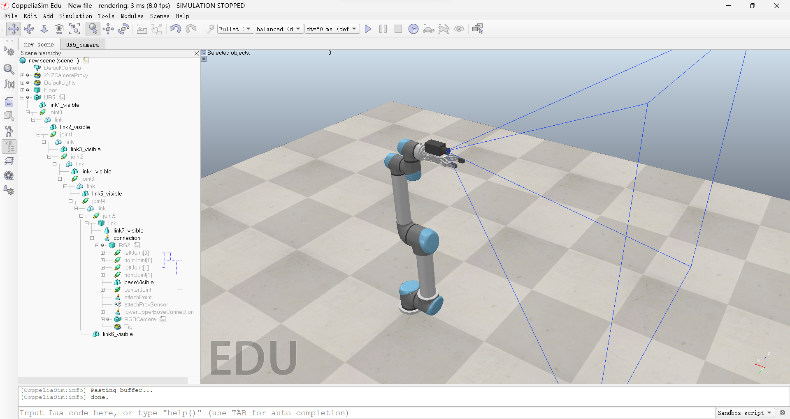
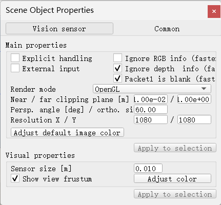
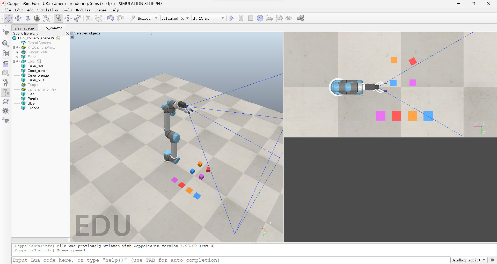
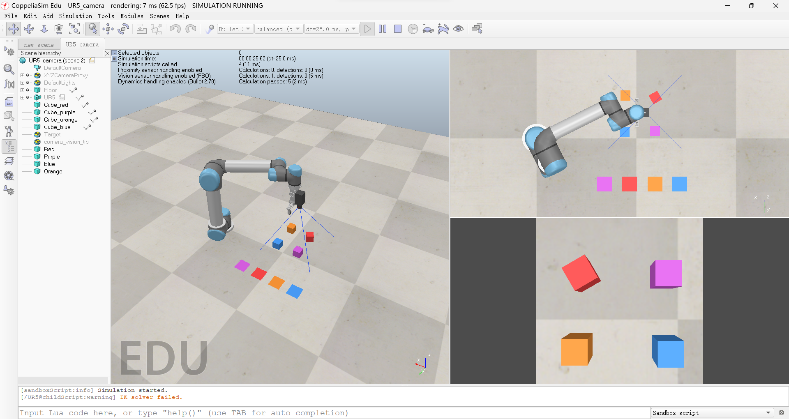
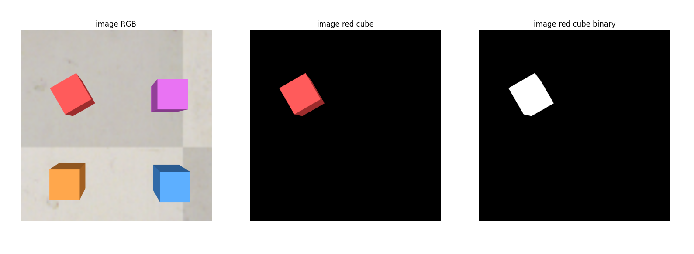
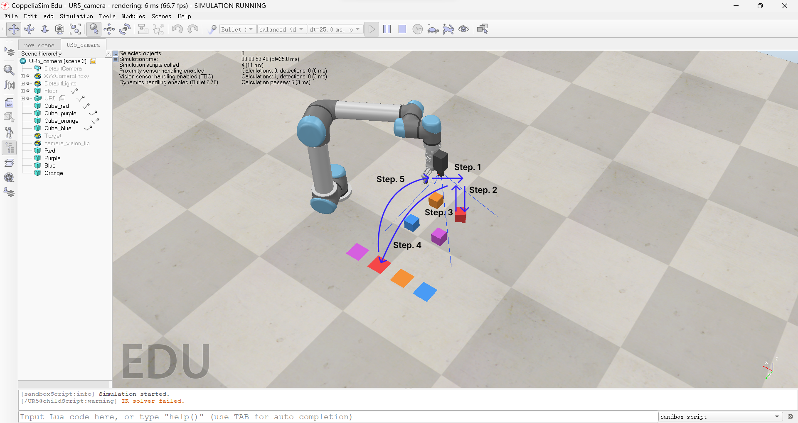

本文描述了一种基于机器视觉以及使用 UR5 六轴机械臂实现将不同颜色物块搬运到相应颜色的区域内，并在  Coppeliasim 中仿真实现。在对物块进行识别时，将RGB通道转换到HSV通道后进行颜色识别，通过图形求矩的方法求取物块中心，同时通过计算相机的内外参数实现将图形平面坐标系下的坐标变换到世界坐标系下，再通过运动学逆解以及轨迹规划实现对物块的抓取搬运，最终实行将不同颜色物块放置到对应的颜色区域内。该文内容在 Coppeliasim 平台中实现并使用其中的 API 实行。


## 1. 方法简要

### 1.1 Coppeliasim 仿真环境搭建

#### 1.1.1 硬件搭建

在 Coppeliasim 仿真平台中，使用 UR5 六轴机械臂, RG2 夹爪和 RGB 相机搭建带有夹爪的手眼系统，将 RGB 相机装配在 RG2 夹爪上，再将 RG2 夹爪装配在 UR5 工具末端，装配结果如图。



其中相机设置视野角为 $60\degree$ ，图像分辨率为 $1080\times1080$ ，具体配置如下。



在该平台中添加四个颜色各不相同的物块，颜色分别为红色，蓝色，紫色以及橙色，并准备相应的颜色区域。准备 OK 的仿真环境如下：



#### 1.1.2 运动学链准备

​		为方便对 UR5 机械臂进行正逆运动学解算，本文使用 Coppeliasim 中内置的运动学方法，具体方法为为 UR5 添加子程序，并添加运动学链来实现对 UR5 的运动学解算。代码见下：

```lua
function sysCall_init()
    local simBase=sim.getObject('.')
    local simTip=sim.getObject('./Tip')
    local simTarget=sim.getObject('/Target')

    ikEnv=simIK.createEnvironment() -- create an IK environment
    ikGroup_undamped=simIK.createIkGroup(ikEnv) -- create an IK group
    simIK.setIkGroupCalculation(ikEnv,ikGroup_undamped,simIK.method_pseudo_inverse,0,6) -- set its resolution method to undamped
    simIK.addIkElementFromScene(ikEnv,ikGroup_undamped,simBase,simTip,simTarget,simIK.constraint_pose) -- create an IK element based on the scene content
    ikGroup_damped=simIK.createIkGroup(ikEnv) -- create another IK group
    simIK.setIkGroupCalculation(ikEnv,ikGroup_damped,simIK.method_damped_least_squares,1,99) -- set its resolution method to damped
    simIK.addIkElementFromScene(ikEnv,ikGroup_damped,simBase,simTip,simTarget,simIK.constraint_pose) -- create an IK element based on the scene content
end

function sysCall_actuation()
    -- There is a simple way, and a more elaborate way (but which gives you more options/flexibility):
    
    -- Simple way:
    if simIK.applyIkEnvironmentToScene(ikEnv,ikGroup_undamped,true)==simIK.result_fail then -- try to solve with the undamped method
        -- the position/orientation could not be reached.
        simIK.applyIkEnvironmentToScene(ikEnv,ikGroup_damped) -- try to solve with the damped method
        if not ikFailedReportHandle then -- We display a IK failure report message
            sim.addLog(sim.verbosity_scriptwarnings,"IK solver failed.")
        end
    end
end 

function sysCall_cleanup() 
    simIK.eraseEnvironment(ikEnv) -- erase the IK environment
end 
```

在为 UR5 添加运动学链后，只需设置 Target Tip 的位置，其仿真平台内部将自动实现逆运动学解算并移动。

### 1.2 python 远程编程准备

​		Coppeliasim 通过建立远程通讯实现远程编程，本文使用官方较为推荐的 ZMQRemote API 实现远程通信，为方便程序的运行，本文不采用添加全局变量的方式使用 ZMQRemote API ，而是将 ZMQRemote API 库拷贝到工程根目录进行调用，工程的目录结构如下：

```tex
Project
├─third_party		// 第三方库
|   ├─coppeliaSim_remoteApiBindings  // CoppeliaSim Legacy Remote Api, 适用于 Matlab 等语言 
|   |   └─...
|   └─coppeliaSim_zmqRemoteApi 		 // CoppeliaSim ZMQ Remote Api, 适用于 Python, C/C++ 等语言
|       └─...
├─main.py			// 仿真主程序
└─UR5_camera.ttt	// 仿真环境
```

在 Python 程序中应调用相应的 API ：

```python
from third_party.coppeliaSim_zmqRemoteApi.zmqRemoteApi import RemoteAPIClient
```

### 1.3 图像处理与位置估算

#### 1.3.1 图像获取

​		在获取图像之前，应将摄像头光轴向下并垂直于地面，同时适当调整位置，使相机可以同时看到四个物块，将此时的位姿配置设置为初始位置即图像识别位置，之后再调用相关 API 获取图像进行颜色识别并定位。获取图像方法如下：

```python
img, resX, resY = sim.getVisionSensorCharImage(cameraHandle)
img = np.frombuffer(img, dtype=np.uint8).reshape([resY, resX, 3])
img = cv.flip(img, 0)
```

在调整好位置后获取的图像如下(右下为相机图像)：



#### 1.3.2 相机内外参数的计算

​		由于相机使用在仿真平台中实现，因此可以方便的获取相机的参数，所以并不需要使用棋盘标定方法即可计算出相机的内参。由 1.1.1 可知，相机的分辨率为 $(P_x, P_y)=(1080,1080)$ ，视野角为 $\theta = 60\degree$ ，可获取当前相机的高度为 $h$ (通过调用 API:  `sim.getObjectPosition(cameraHandle, -1)`)，其内参为
$$
\left[
\begin{matrix}
   \alpha & 0     & p_x \\
   0      & \beta & p_y \\
   0      & 0     & 1
\end{matrix}
\right]
$$
其中有
$$
\begin{cases}
\alpha = \beta = \frac{P_x}{2 h \cdot \tan(\theta)} \\
p_x = \frac{1}{2}P_x \\
p_y = \frac{1}{2}P_y
\end{cases}
$$
其外参可以通过 Coppeliasim 内置的 API 模块获取，即

```python
sim.getObjectMatrix(camera_tip, -1)
```

该 API 将获取齐次变换矩阵的前三行，即 $\left[\begin{matrix} R & t \end{matrix}\right]$ ，其中 $R$ 为 $3\times 3$ 的旋转矩阵，$t$ 为 $3 \times 1$ 的平移矢量，为方便后续计算，将其拓展为齐次变换矩阵为
$$
T_{cw} = \left[\begin{matrix} 
	R_{3\times 3} & t_{3\times 1} \\
    0_3 &1
\end{matrix}\right]
$$
该矩阵即表示由相机坐标系转换为世界坐标系的齐次变换矩阵。

#### 1.3.3 颜色识别的实现

​		由于在 RGB 通道下，颜色由三个值(即 RGB )决定，是不连续的，不便于对颜色等图像信息进行分析和处理，故将其转换为 HSV 通道后再进行分析处理，由于颜色在 H 通道上是连续的，可以通过取阈值的方法区分颜色，其中由于红色在 H 通道上的值为 0(360)，不易与背景进行区分，因此还应考虑上 SV 两个通道来区分背景。在颜色识别成功之后，通过二值法可以将物块单独提取出来进行之后的处理。



#### 1.3.4 像素位置估计

​		由于每个颜色的物块像素位置的计算方法一样，该方法描述中仅以红色物块为例，由于在 1.3.2 中已经将特定颜色物块(红色)的二值图(上图)，通过计算图像矩的方式获取物块中心的像素坐标。

#### 1.3.5 实际位置估计

​		假设 1.3.4 中得到的像素坐标为 $(x_p,y_p)$ ，根据 1.3.2 中计算的相机内参，可以计算物块中心在相机坐标系下的坐标 $p_c$ ，即
$$
p_c = (x_c, y_c, z_c)
$$
其中
$$
\begin{cases}
x_c = \frac{x_p-p_x}{\alpha} \\
y_c = \frac{y_p-p_y}{\beta}  \\
z_c = h
\end{cases}
$$
根据 1.3.2 中计算的相机外参，可以计算世界坐标系下的坐标，即实际位置
$$
\left[\begin{matrix} 
	p_w  \\
    1    \\
\end{matrix}\right] = T_{cw}
\left[\begin{matrix} 
	p_c \\
    1
\end{matrix}\right]
$$

### 1.4 机械臂动作

​		在运动之前应确保 RG2 夹爪是打开状态，避免夹爪与物块发生碰撞进而对机械臂造成损伤。根据 1.3 获取物块实际位置后，可通过 Coppeliasim 的运动学链进行运动学解算，本文采用 Coppeliasim 内置的轨迹规划器实现机械臂的运动，其运动过程如下：

1. 将机械臂末端水平移动到物块上方
2. 机械臂向下移动并关闭夹爪夹取物块
3. 机械臂向上移动
4. 将机械臂末端移动对应的颜色区域
5. 将机械臂恢复到相机识别位置
6. 重复检测识别，以及上述运动过程

其过程示意如下。



## 2. 问题分析

### 2.1 存在的问题

​		在上述的完整过程中存在一些问题，当通过 1.3 的方法计算物块的实际位置时，其解算位置存在一定的误差，在使用以上方法时，该位置误差是无法避免的，其原因如下：

- 四个物块同时存在于一张图片中，由于透视从 1.3.3 中提取出的物块并不是规整的正方形，这意味着在 1.3.4 中计算的物块中心并不是实际的物块中心，而是存在偏差的，该偏差将在后续的计算中被逐渐放大从而使计算得到的实际位置存在较大误差。
- 相机的内参包含的实际物理意义为图像中一个像素所对应的实际物理大小，由 1.3 中的计算可知，相机的分辨率以及相机的高度都将影响物块的定位精度。因此，在 1.3 中描述的定位方法都只是对实际位置的估计并非准确值。

### 2.2 一种解决方法

​		解决上述问题的一种方法是进行迭代以不断减小误差，其方法为：机械臂运动到物块上方时，即1.4 中 step.1 结束后，不直接进行 step.2 ，而是重新进行定位，并进行 step.1 中的水平移动，在重复有限次后，继续 step.2 及之后的运动。

## 3. 结果展示

结果展示如下：

<video src="./assets/video/video.mp4" style="zoom:50%;"></video>
